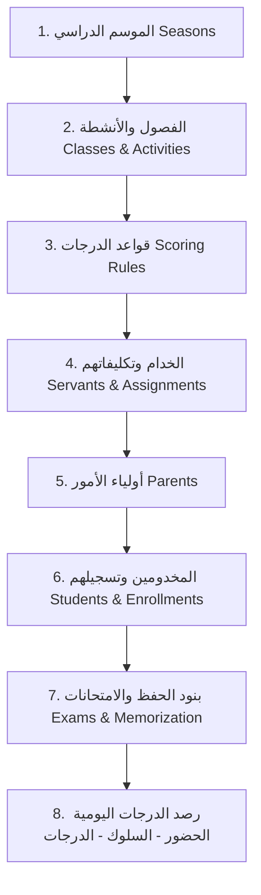

# دليل توثيق نظام إدارة مهرجان الكرازة المرقسية 🏆

أهلاً بك في دليل التشغيل والتوثيق الشامل لمنصة **مهرجان الكرازة**. تم تصميم هذا النظام لرقمنة وإدارة فعاليات مهرجان الكرازة بالكامل، بدءاً من تسجيل الفصول والمخدومين، مروراً برصد الحضور اليومي والامتحانات والمحفوظات والأنشطة، وصولاً إلى احتساب لوحة شرف تفاعلية وبوابات مخصصة لأولياء الأمور لمتابعة أداء أبنائهم لحظة بلحظة.

---

## 🌟 1. الشاشة العامة ولوحة الشرف (Public Leaderboard)

الشاشة العامة هي الواجهة الرئيسية والجاذبة للجمهور وللمخدومين، وتهدف إلى بث روح الحماس والتنافس الإيجابي من خلال إبراز المتميزين.

### ما تعرضه الشاشة العامة:
1. **لوحة الشرف الذهبية:** إطار بتصميم كلاسيكي فاخر مستوحى من طابع المهرجان، مع مؤثرات بصرية وتأثيرات بريق (Sparkles) وجزيئات لامعة متحركة متحركة تتناسب مع الهوية البصرية للكنيسة.
2. **شعار المهرجان ورسالته:** يظهر الشعار بوضوح في الأعلى مع آية المهرجان المُلهمة *"يعظم انتصارنا بالذي أحبنا"*.
3. **أزرار تصفية الفصول (Class Filters):** تتيح للمستخدمين تصفية لوحة الشرف لعرض ترتيب مخدومي فصل معين (مثل: "أولى ابتدائي") أو عرض الترتيب العام لكل الفصول ("الكل").
4. **كروت ترتيب المخدومين:** 
   - **المراكز الثلاثة الأولى:** يتم تمييزها بميداليات خاصة (🥇 للمركز الأول، 🥈 للمركز الثاني، 🥉 للمركز الثالث) مع إطار مضيء وتأثيرات حركية عائمة تعكس التميز الفائق.
   - **الترتيب التلقائي:** يتم حساب الترتيب تنازلياً بدقة بناءً على المجموع الإجمالي الفعلي الحاصل عليه المخدوم.
   - **الصورة الشخصية أو الصورة الرمزية (Avatar):** تُعرض الصورة الشخصية للمخدوم، وفي حال عدم رفعها يتم إنشاء صورة رمزية ملونة ديناميكية تحمل الحروف الأولى من اسمه بشكل جمالي متناسق.
   - **مؤشر التقدم (Progress Bar):** شريط ملون متدرج يعرض نسبة تميز المخدوم البصرية مقارنة بأعلى درجة حاصل عليها مخدوم آخر في الترتيب.
   - **شارات الأوسمة (Badges):** تظهر الأوسمة الحاصل عليها المخدوم (مثل وسام المواظبة، وسام الحفظ) بشكل شارات أنيقة بجانب اسمه.

---

## 📊 2. معايير التقييم والدرجات (Evaluation & Scoring System)

يتم احتساب درجات المخدومين وترتيبهم بشكل تلقائي وفوري بناءً على **قواعد التوزيع** التي يضعها مدير النظام عبر نظام الأوزان والنسب المئوية.

### الأوزان النسبية (Weights):
يتم تحديد الوزن النسبي لكل تصنيف من التقييمات لكل فصل دراسي أو موسم بشكل مستقل من خلال لوحة التحكم (`ScoringRule`) ليعادل إجمالي **100%**، وتتوزع الأوزان الافتراضية كالتالي:
* **الحضور والغياب:** 20%
* **الامتحانات:** 30%
* **المحفوظات والتسميع:** 20%
* **الأنشطة المدرسية/الكرازية:** 20%
* **السلوك والملاحظات:** 10%

### كيفية احتساب تقييم كل تصنيف:

#### 1. الحضور والغياب (Attendance):
* يتم رصد الحضور لجمع دراسية محددة.
* يُحسب التقييم بالمعادلة:
  $$\text{درجة الحضور} = \frac{\text{عدد أيام الحضور الفعلي} + \text{عدد أيام الاعتذار المقبول}}{\text{إجمالي الأيام الدراسية المتاحة للفصل}} \times 100$$
  > [!NOTE]
  > الحالات التي تعتبر حضوراً هي: **حاضر (Present)** و **معتذر (Excused)**. أما حالة **غائب (Absent)** فلا تُحتسب وتُقلل من نسبة الحضور الإجمالية للمخدوم.

#### 2. الامتحانات (Exams):
* يُحسب متوسط الدرجات الحاصل عليها المخدوم في كافة الامتحانات التي خاضها مقسومة على الدرجات النهائية الكلية لتلك الامتحانات ويتم تحويلها لنسبة مئوية من 100.

#### 3. المحفوظات (Memorization):
* يُحسب متوسط أداء المخدوم في تسميع بنود المحفوظات المطلوبة منه ليعطي نسبة مئوية إجمالية لمدى تقدمه في التسميع والحفظ.

#### 4. الأنشطة (Activities):
* يُحسب متوسط درجات المخدوم في كافة الأنشطة والمسابقات المسجل بها ومؤهل للمشاركة فيها، ويُعامل كنسبة مئوية.

#### 5. السلوك والملاحظات (Behavior):
* المخدوم يبدأ بسجل سلوكي نظيف، ويقوم الخدام برصد نقاط سلوكية إيجابية (مثل: مساعدة خادم، هدوء، مشاركة متميزة) أو نقاط سلبية (مثل: شغب، عدم التزام).
* يتم جمع النقاط الإيجابية والسلبية كـ (مجموع تراكمي) يمثل نقاط السلوك المؤثرة في الدرجة الإجمالية.

#### 🏁 احتساب المعدل النهائي (Final Grade):
يتم تطبيق الأوزان على نسب التقييمات كما يلي:
$$\text{المعدل العام} = (\text{نسبة الحضور} \times W_{att}) + (\text{نسبة الامتحانات} \times W_{ex}) + (\text{نسبة المحفوظات} \times W_{mem}) + (\text{نسبة الأنشطة} \times W_{act}) + (\text{مجموع نقاط السلوك} \times W_{beh})$$

---

## 👨‍👩‍👧‍👦 3. بوابة ولي الأمر (Parent Portal)

بوابة ولي الأمر هي لوحة تحكم تفاعلية متكاملة مصممة خصيصاً لأولياء الأمور لتمكينهم من متابعة تفاصيل أداء أبنائهم ودعمهم دراسياً وسلوكياً.

### ما الذي يراه ولي الأمر ويستطيع القيام به؟

1. **عرض قائمة الأبناء:** يظهر كل ابن مسجل في بطاقة خاصة مميزة تحتوي على:
   - اسم الابن، صورته الشخصية، وفصله الدراسي.
   - **الترتيب الدراسي:** يظهر ترتيب الابن على مستوى فصله الدراسي، مع ميداليات المراكز الأولى (🥇، 🥈، 🥉) للتشجيع الفوري.
   - **المعدل العام:** النسبة المئوية العامة لأداء الابن المحدثة تلقائياً.
2. **تعديل وتحديث الصورة الشخصية:** يستطيع ولي الأمر النقر مباشرة على دائرة الصورة الشخصية لكل ابن لرفع أو تعديل صورته الشخصية، ليتم تحديثها فوراً في قاعدة البيانات وتظهر في لوحة الشرف العامة.
3. **أوسمة الابن:** عرض قائمة الأوسمة التشجيعية التي نالها الابن من خدامه تقديراً لجهوده.
4. **سجل السلوك الفوري:** عرض آخر التحديثات السلوكية الإيجابية والسلبية الممنوحة للابن مع أسبابها التفصيلية.
5. **لوحة التفاصيل التبويبية (Tabbed Details Pane):**
   عند النقر على "عرض كافة التفاصيل"، تنفتح قائمة تفاعلية مقسمة إلى ألسنة تبويب مخصصة:
   - **📅 الحضور والغياب:** سجل تفصيلي وتاريخي بالتواريخ لكل يوم حضور دراسي وحالة الابن فيه (حاضر / معتذر / غائب) مع ملاحظات الخادم المدونة لكل حصة.
   - **📝 الامتحانات:** قائمة بالامتحانات التي أداها المخدوم، درجاته التفصيلية مقارنة بالدرجة الكلية للامتحان، شريط تقدم مرئي ملون يُظهر جودة أدائه، وملاحظات الخادم على أدائه.
   - **📖 المحفوظات:** تفاصيل بنود التسميع المطلوبة وحالة حفظها (تم الحفظ وبانتظار التقييم / تم الإنجاز بنجاح) وملاحظات الخادم التوجيهية.
   - **🎯 الأنشطة:** الأنشطة والمسابقات المشترك بها الابن، وحالته فيها (مؤهل / مشترك)، مع متوسط تقييم أدائه في كل نشاط.
   - **✨ السلوك والملاحظات:** سجل كامل وتاريخي لكافة النقاط السلوكية المرصودة للابن إيجاباً وسلباً مع تقديم نصائح ذكية وتلقائية لأولياء الأمور لتشجيع وتطوير مستويات أبنائهم.

---

## 🎛️ 4. لوحة الإدارة وأنواع المستخدمين (Admin Panel & Roles)

يعتمد النظام على صلاحيات صارمة مقسمة على ثلاثة أنواع رئيسية من الحسابات لضمان أمان البيانات وخصوصيتها وتيسير العمل.

### 👤 1. المدير العام (Super Admin)
* **دوره:** إدارة النظام بالكامل دون أي قيود.
* **ما يمكنه فعله ورؤيته:**
  - إدارة المواسم الدراسية وتفعيل الموسم الحالي.
  - تعريف الفصول الدراسية وتعديلها.
  - تعيين قواعد توزيع الدرجات (Scoring Rules) وتوزيع الأوزان على الفصول.
  - إدارة حسابات المستخدمين والخدام وتعيين أدوارهم وصلاحياتهم.
  - إدارة حسابات أولياء الأمور المستقلة وربطهم بأبنائهم.
  - رصد وإدارة بيانات المخدومين بالكامل وتوزيعهم على الفصول والمواسم الدراسية.
  - رفع واستيراد كشوف الحضور والدرجات الجماعية عبر ملفات CSV وتصدير النماذج المخصصة للفصول.
  - الوصول لكافة التقارير التفصيلية والإحصائيات على مستوى كل الفصول.

### 👥 2. الخادم (Servant)
* **دوره:** رصد وإدخال وتحديث بيانات الفصل أو الأنشطة المكلف بها فقط.
* **ما يمكنه فعله ورؤيته (صلاحيات مقيدة تلقائياً بنطاق تكليفه):**
  - رؤية الفصول الدراسية والأنشطة المكلف بها إدارياً فقط من قبل المدير.
  - تسجيل حضور المخدومين للفصل الخاص به وإنشاء جمع حضور جديدة.
  - رصد درجات امتحانات المخدومين وتسميع المحفوظات للفصل التابع له.
  - تسجيل النقاط السلوكية للمخدومين في فصله.
  - رصد تقييمات ودرجات الأنشطة المكلف بها.
  - *لا يملك الخادم صلاحية تعديل الهيكل الإداري للنظام، أو إضافة مستخدمين جدد، أو تغيير الأوزان والقواعد التقييمية.*

### 👨‍👩‍👧‍👦 3. ولي الأمر (Parent)
* **دوره:** معزول كلياً عن لوحة الإدارة (`admin panel`).
* **ما يمكنه فعله ورؤيته:**
  - يتم توجيهه تلقائياً إلى واجهة مستخدم مبسطة وجذابة على المسار (`/parent`).
  - يملك صلاحية القراءة والعرض فقط لبيانات أبنائه المتربطين بحسابه.
  - يملك صلاحية وحيدة للتعديل وهي رفع وتحديث الصورة الشخصية للابن.

---

## 🚀 5. دليل خطة إدخال البيانات المنهجي (Data Entry Roadmap)

عند إطلاق النظام لأول مرة أو بدء موسم جديد، يجب اتباع التسلسل التالي بدقة لضمان ترابط البيانات بنجاح وتفادي ظهور أخطاء برمجية متعلقة بالعلاقات بين الجداول:

### 📂 الخطوات التفصيلية لإدخال البيانات:

#### 1️⃣ الخطوة الأولى: تهيئة المواسم الدراسية (Seasons)
* **أين يتم الإدخال؟** لوحة التحكم -> المواسم (`Seasons`).
* **طريقة الإدخال:** إضافة موسم جديد (مثال: "مهرجان الكرازة 2026") وتفعيله ليكون هو الموسم النشط.

#### 2️⃣ الخطوة الثانية: إضافة الفصول والأنشطة (Classes & Activities)
* **أين يتم الإدخال؟** لوحة التحكم -> الفصول (`Classes`) & الأنشطة (`Activities`).
* **طريقة الإدخال:**
  - إدخال فصول المهرجان (مثال: أولى ابتدائي، ثانية ابتدائي، حضانة، إلخ).
  - إدخال الأنشطة والمسابقات المتوفرة (مثال: مسابقة الرسم، مسابقة كرة القدم، مسابقة الشطرنج).

#### 3️⃣ الخطوة الثالثة: ضبط قواعد احتساب الدرجات (Scoring Rules)
* **أين يتم الإدخال؟** لوحة التحكم -> قواعد توزيع الدرجات (`Scoring Rules`).
* **طريقة الإدخال:** اختيار الموسم والفصل، ثم كتابة الأوزان النسبية للتقييمات (الحضور، الامتحانات، المحفوظات، الأنشطة، السلوك) بحيث يكون مجموعها 100.

#### 4️⃣ الخطوة الرابعة: تسجيل الخدام وتعيين أدوارهم وتكليفاتهم (Users & Servants)
* **أين يتم الإدخال؟** لوحة التحكم -> المستخدمين والخدام (`Users`).
* **طريقة الإدخال:** 
  - تسجيل حساب جديد للخادم (الاسم، الهاتف، كلمة المرور).
  - تعيين دور "خادم (Servant)" له.
  - اختيار الفصول والأنشطة التي سيكون هذا الخادم مسؤولاً عن إدارتها ورصد درجاتها.

#### 5️⃣ الخطوة الخامسة: تسجيل أولياء الأمور (Parents)
* **أين يتم الإدخال؟** لوحة التحكم -> أولياء الأمور (`Parents`).
* **طريقة الإدخال:** تسجيل حساب ولي الأمر بالاسم ورقم الهاتف وكلمة المرور ليتمكن من الدخول لبوابة ولي الأمر.

#### 6️⃣ الخطوة السادسة: تسجيل المخدومين وتوزيعهم (Students & Enrollments)
* **أين يتم الإدخال؟** لوحة التحكم -> المخدومين (`Students`) & تسجيلات المواسم (`Season Enrollments`).
* **طريقة الإدخال:** 
  - إدخال بيانات المخدوم الأساسية (الاسم بالكامل، كود المخدوم المميز، اختيار ولي أمره من القائمة).
  - ربط المخدوم بالفصل والموسم النشط عبر تسجيلات المواسم لتفعيل ملفه التقييمي.

#### 7️⃣ الخطوة السابعة: رصد بنود التقييم اليومي والدراسي
* **الامتحانات والمحفوظات:** تعريف الامتحانات وتاريخها والدرجة النهائية لها، وتعريف بنود التسميع المطلوبة لكل مرحلة.
* **رصد الحضور اليومي:** إنشاء "يوم حضور جديد" للفصل، ثم رصد حضور المخدومين (حاضر / غائب / معتذر) أو استيراد كشف حضور جماعي عبر شيت CSV لتوفير الوقت والجهد على الخدام.
* **تسجيل الدرجات والسلوكيات:** إدخال درجات التسميع والامتحانات للطلاب، ورصد نقاط السلوك المباشرة بشكل تراكمي.

---

> [!TIP]
> يضمن هذا التسلسل عدم حدوث تعارض أو فقدان للترابط، ويسهل على الخدام العمل مباشرة فور تسجيلهم بفضل توزيع التكليفات المناسب.
